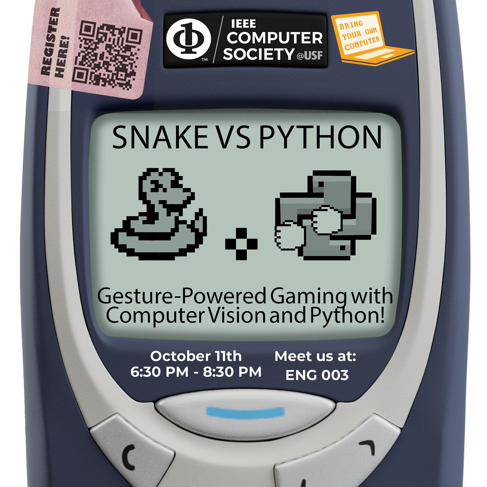

# Gesture Powered Gaming with Computer Vision and Python

A workshop run by the IEEE Computer Society student branch chapter at the University of South Florida. You steer the snake with your hand in front of the webcam instead of with the arrow keys, and it still wants apples.

Wednesday, October 11, 2023, 6:30 to 8:30 PM, ENG 3.

- [Announcement on Instagram](https://www.instagram.com/p/CyBqYtvOz7V/)
- [Recap on Instagram](https://www.instagram.com/p/CyT9m9UxH6f/)

## Notes from the workshop

This is a code from the workshop "Gesture Powered Gaming with Computer Vision and Python". Don't forget to have a device with webcamera and install cvzone and mediapipe (if you are confused, read the computer-vision-workshop.pptx).

computer-vision-workshop.pptx is the PowerPoint that was used during the workshop. Refer to it if you need to start the project from scratch.

**main.py** is the final code of the project. It has everything we did during the workshop with code for collision for the snake and that missing line that enables snake to eat apples.
**starter_code.py** is the code we started with during the workshop

If you want to learn more about computer vision using cvzone, check out https://github.com/cvzone/cvzone
